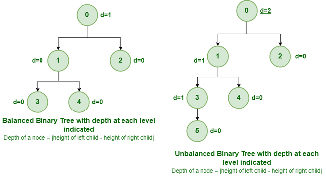
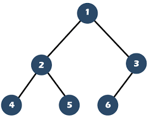

# Binary Tree

Hierarchical data structure composed of `Nodes` on which every Node can have up to 2 children Nodes
`Left` and `Right`. The top of the tree is called `Root`. 

## Balanced Binary Tree
A balanced binary tree or height-balanced binary tree is such a tree whose left and right subtrees' heights differ by not more than 1, which means the height difference could be -1, 0, and 1. A balanced binary tree is also known as a height-balanced tree.



## Binary Search Tree (BST)
A BST is a binary tree that satisfies the BST invariant: left subtree has smaller elements and 
right subtree has larger elements.


### AVL Tree
TBD

### Red Black Tree
TBD

## Complete Binary Tree
A `complete binary tree` is a tree in which at every level, except possibly the last is completely filled and all nodes are as far left as possible.



## Full Binary Tree
A `full binary tree` is a binary tree with either zero or two child nodes for each node. 


### Binary tree use cases
- Red Black Trees
- AVL Trees
- Splay Trees
- Binary heaps
- Treap - a probabilistic data structure (uses a randomized BST)

```go
type Node[T any] struct {
    value T
    left *Node[T]
    right *Node[T]
}

// for BST ignore duplications
func (n *Node[T]) insert(val T) {
    if val < n.value {
        if n.left == nil {
            n.left = &Node{value: val}
        } else {
            n.left.insert(value)
        }
    } else if n > n.value {
        if n.right == nil {
            n.right = &Node{value: val}
        } else {
            n.right.insert(value)
        }
    }
}

type Tree[T] struct {
    node *Node[T]
}

func(t *Tree[T]) insert(val T) *Tree {
    if node == nil {
        t.node = &Node{value: val}
    } else {
        t.node.insert(val)
    }

    return t
}


```