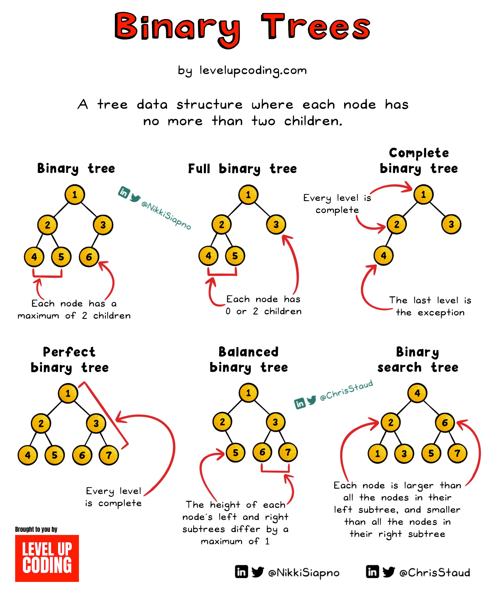

# Binary Tree

Hierarchical data structure composed of `Nodes` on which every Node can have up to 2 children Nodes
`Left` and `Right`. The top of the tree is called `Root`. 



```go
type Node[T any] struct {
    value T
    left *Node[T]
    right *Node[T]
}

// this type of insert will produce a balanced tree
func (n *Node[T]) insert(val T) {
    if val <= n.value {
        if n.left == nil {
            n.left = &Node{value: val}
        } else {
            n.left.insert(value)
        }
    } else {
        if n.right == nil {
            n.right = &Node{value: val}
        } else {
            n.right.insert(value)
        }
    }
}

type Tree[T] struct {
    node *Node[T]
}

func(t *Tree[T]) insert(val T) *Tree {
    if node == nil {
        t.node = &Node{value: val}
    } else {
        t.node.insert(val)
    }

    return t
}


```